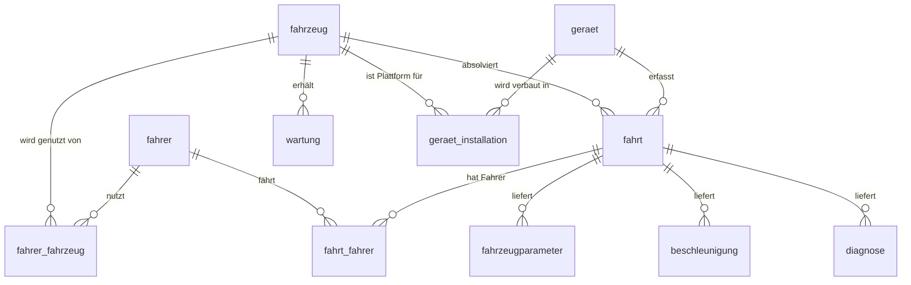

# Datenmodell – Inventarisierung der Quelldateien ↔ MySQL‑Tabellen

Nachfolgend sind **alle im Projekt vorhandenen CSV‑Dateien** aufgelistet, jeweils mit ihrer Zuordnung zur MySQL‑Tabelle und einer Kurzbeschreibung der Spalten inklusive Primär‑ und Fremdschlüssel‑Beziehungen.

---

## 1 ▪ Tabelle `fahrzeug`  ⇢ *01_fahrzeug.csv*

| Spalte | Typ | Beschreibung |
|---------|-----|--------------|
| `id` | INT (PK) | Eindeutige Fahrzeug‑ID |
| `hersteller` | VARCHAR | Hersteller‑/Markenname |
| `modell` | VARCHAR | Modellbezeichnung |
| `baujahr` | INT | Baujahr des Fahrzeugs |

**Primärschlüssel:** `id`   ·  **Fremdschlüssel‑Ziel** anderer Tabellen (→ `fahrzeugid`).

---

## 2 ▪ Tabelle `fahrer`  ⇢ *02_fahrer.csv*

| Spalte | Typ | Beschreibung |
|---------|-----|--------------|
| `id` | INT (PK) | Fahrer‑ID |
| `vorname` | VARCHAR | Vorname |
| `nachname` | VARCHAR | Nachname |
| `geburtsdatum` | DATE | Geburtsdatum |
| `kontakt_nr` | INT | Telefonnummer |
| `email` | VARCHAR | E‑Mail |

**Primärschlüssel:** `id`  ·  Wird u. a. in `fahrer_fahrzeug` und `fahrt_fahrer` referenziert.

---

## 3 ▪ Tabelle `fahrer_fahrzeug`  ⇢ *03_fahrer_fahrzeug.csv*

| Spalte | Typ | Beschreibung |
|---------|-----|--------------|
| `fahrerid` | INT (FK→`fahrer.id`) | Zugeordneter Fahrer |
| `fahrzeugid` | INT (FK→`fahrzeug.id`) | Zugeordnetes Fahrzeug |
| `gueltig_ab` | DATE | Start der Zuordnung |
| `gueltig_bis` | DATE | Ende der Zuordnung (NULL = aktuell) |

**Composite Primary Key:** `(fahrerid, fahrzeugid, gueltig_ab)`

---

## 4 ▪ Tabelle `geraet`  ⇢ *04_geraet.csv*

| Spalte | Typ | Beschreibung |
|---------|-----|--------------|
| `id` | INT (PK) | Geräte‑ID |
| `fahrzeugid` | INT (FK→`fahrzeug.id`) | Ursprünglich zugewiesenes Fahrzeug *(Historie siehe `geraet_installation`)* |
| `geraet_typ` | VARCHAR | Gerätekategorie (OBD‑Dongle, Blackbox …) |
| `hersteller` | VARCHAR | Gerätehersteller |
| `modell` | VARCHAR | Modellbezeichnung |

---

## 5 ▪ Tabelle `fahrt`  ⇢ *05_fahrt.csv*

| Spalte | Typ | Beschreibung |
|---------|-----|--------------|
| `id` | INT (PK) | Fahrt‑ID |
| `fahrzeugid` | INT (FK→`fahrzeug.id`) | Gefahrenes Fahrzeug |
| `geraetid` | INT (FK→`geraet.id`) | Erfassendes Telematikgerät |
| `startzeitpunkt` | DATETIME | Start der Fahrt |
| `endzeitpunkt` | DATETIME | Ende der Fahrt |
| `route` | VARCHAR | Routen‑/Tour‑Nr. o. Ä. |

---

## 6 ▪ Tabelle `fahrt_fahrer`  ⇢ *06_fahrt_fahrer.csv*

| Spalte | Typ | Beschreibung |
|---------|-----|--------------|
| `fahrtid` | INT (FK→`fahrt.id`) | Fahrt |
| `fahrerid` | INT (FK→`fahrer.id`) | Fahrer |

**Composite Primary Key:** `(fahrtid, fahrerid)`

---

## 7 ▪ Tabelle `fahrzeugparameter`  ⇢ *07_fahrzeugparameter.csv*

| Spalte | Typ | Beschreibung |
|---------|-----|--------------|
| `id` | INT (PK) | Messwert‑ID |
| `fahrtid` | INT (FK→`fahrt.id`) | Zugehörige Fahrt |
| `zeitstempel` | TIMESTAMP | Zeitpunkt der Messung |
| `geschwindigkeit` | FLOAT | km/h |
| `motortemperatur` | FLOAT | °C |
| `luftmassenstrom` | FLOAT | g/s |
| `batterie` | FLOAT | Spannung V |

---

## 8 ▪ Tabelle `beschleunigung`  ⇢ *08_beschleunigung.csv*

| Spalte | Typ | Beschreibung |
|---------|-----|--------------|
| `id` | INT (PK) | Messwert‑ID |
| `fahrtid` | INT (FK→`fahrt.id`) | Fahrt |
| `zeitstempel` | TIMESTAMP | Zeitpunkt |
| `x_achse` | FLOAT | m/s² |
| `y_achse` | FLOAT | m/s² |
| `z_achse` | FLOAT | m/s² |

---

## 9 ▪ Tabelle `diagnose`  ⇢ *09_diagnose.csv*

| Spalte | Typ | Beschreibung |
|---------|-----|--------------|
| `id` | INT (PK) | Eintrag‑ID |
| `fahrtid` | INT (FK→`fahrt.id`) | Fahrt |
| `zeitstempel` | TIMESTAMP | Zeitpunkt des Codes |
| `fehlercode` | VARCHAR | OBD/ISO‑Code |
| `beschreibung` | VARCHAR | Textbeschreibung |

---

## 10 ▪ Tabelle `wartung`  ⇢ *10_wartung.csv*

| Spalte | Typ | Beschreibung |
|---------|-----|--------------|
| `id` | INT (PK) | Wartungs‑ID |
| `fahrzeugid` | INT (FK→`fahrzeug.id`) | Gewartetes Fahrzeug |
| `datum` | DATE | Wartungsdatum |
| `beschreibung` | VARCHAR | Art der Wartung/Kommentar |

---

## 11 ▪ Tabelle `geraet_installation`  ⇢ *11_geraet_installation.csv*

| Spalte | Typ | Beschreibung |
|---------|-----|--------------|
| `id` | INT (PK) | Installations‑ID |
| `geraetid` | INT (FK→`geraet.id`) | Verbautes Gerät |
| `fahrzeugid` | INT (FK→`fahrzeug.id`) | Fahrzeug |
| `einbau_datum` | DATE | Einbaudatum |
| `ausbau_datum` | DATE | Ausbau/Deinstallationsdatum (NULL = verbaut) |

---

## 12 ▪ Geplante NoSQL‑Collections

| Datei | Ziel | Bemerkung |
|-------|------|-----------|
| `fahrt.json` | **(zu klären)** – ggf. Positionsdaten / Route als Sub‑Collection je Fahrt | Struktur prüfen & Mapping entscheiden |
| `unfall.json` | MongoDB‑Collection `unfaelle` | Gemäß `TODO.md` erst in Teil 2 importieren |

---

### Beziehungen (Kurzüberblick)

✅ Damit ist die Inventarisierung der Quelldateien vollständig und konsistent mit dem relationalen Schema abgeschlossen.

